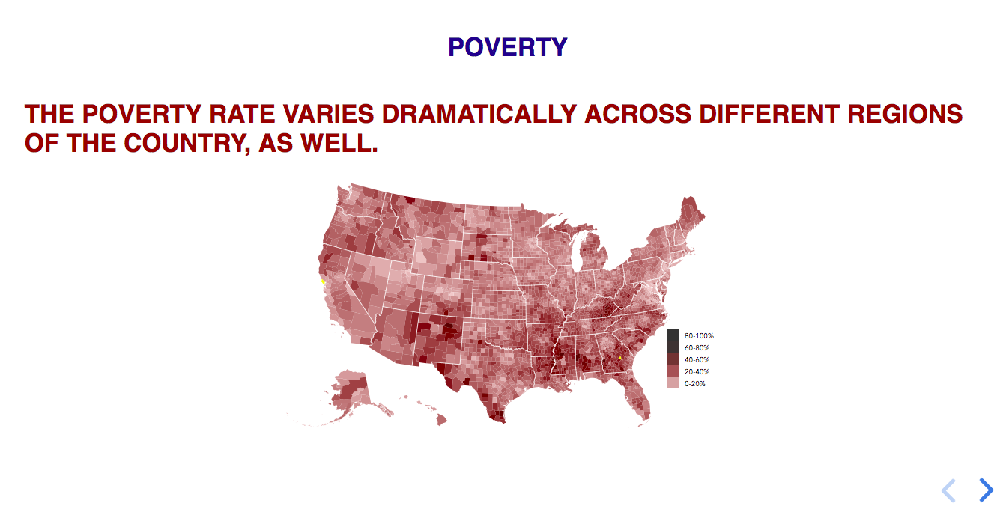

# reveal_rfp - Poverty vignette

This repository contains code for a Real Facts interactive web vignette on USA poverty. Basic layout as roughly as follows in screenshot below -- clickable slides with interactive visualizations and transitions based on user input. As tools, Javascript and D3.js are relied upon heavily to add the visualization and interactivity.



## To use:

1. `git clone https://github.com/wnowak10/reveal_rfp.git`
2.  Download and launch [MAMP](https://www.mamp.info/en/).
3. At MAMP open, click 'Start Servers' > 'Open WebStart Page' > 'My Website' and then navigate to `employment/` or whatever you titled this cloned directory. From there, click on `docs/` which contains source code to run this vignette in your browser. The start page should look like the slide screenshotted above. 

## `docs` README:

Repository structure borrowed from [Reveal.js](https://revealjs.com/#/). `index.html` contains references to individual slides, which are often (if not always) their own HTML pages with D3.js interactives...which are themselves stored in the `content` directory. 

This structure is inelegant, as changes to the site often require changes to both `index.html` and individual slides.

- `content/`: contains `data` and `slides` directories with key content for site.

- `index.html` - body HTML file, contains code for the 'script' of our HTML vignette.

- `js/` : A suite of JS libraries...to note, `reveal` contains functinality for reveal.js library...however, the start of the file also now contains some custom functionality to allow us to customize the behavior of the user's right arrow clicks. 

## How to's:

### How to add a slide?

To add a slide, we use to different methods (TO DO: what is/are the difference(s)?) add to `index.html`:


 .1. Add `<section>` with class name and then use JQuery to load.

```
$(function() {
	$(".<EXAMPLE>").load("content/slides/<EXAMPLE>/<EXAMPLE>")
			 }
  )
```
Followed by 

```
<section>
	<div class="<EXAMPLE>"></div>
</section>
```

 .2. Load directly.
 
```
<section>
<!-- D3 HTML files should be called with the following
     class and data-file attributes. -->
	<div class="fig-container" 
	data-file="content/slides/<EXAMPLE_D3_DIR>/index.html">
	</div> 	
</section>
```

### How to edit URL?

1. Navigate to github repository.
2. Scroll to 'GitHub Pages'
3. Ensure that 'Source' is set to 'master branch /docs folder'. In so doing, your repo will be live at 'YOUR_GH_USERNAME.github.io/REPO_NAME'.
4. To change to a different domain, update proper domain to 'Custom domain' on github Settings > GitHub Pages section.
5. We're currently using Google domains to manage our domains. To link google domains and github pages, [here](https://medium.com/@Tnylnc/tnylnc-how-to-set-up-github-pages-with-google-domains-83bd5a4fbc5c) is a tutorial on Medium from 'Luis L', pasted below for posterity:

```
How to set up Github Pages with Google domains
You are writing the last line of code on your awesome webpage, now you want the world to see it. Or you are a first time user of Github pages, it can be confusing at first. I read many helpful tutorials that helped me but I just wanted to write my own that hopefully will help someone set up their page too.

First make a Github page
First create a repo just call it whatever you’d like. In this example I called it “awesome-website”. Github has a pretty good page on how to do this, I’d recommend using that tutorial. Once you’ve made your Github page you’ll be ready to set up your Google Domain with Github pages.

Setup Google Domain name

Now, to the reason I wrote this. Go to google domains and buy a domain.

Go back to Github …


Create another file. This is the CNAME file that simply has the domain name. In this case I added the apex name or “whatever.com” and the other is the “www” subdomain added to the root domain which is “whatever.com”.

Note: the apex name is also the root name. It is called other things too.
Then write a commit message and save it. Next look in settings and see that the name is different.


So far your page should look like this. It still needs to be configured in your Google Domains settings.

Note: Once you’ve configured the DNS, the website url will turn green.
Now lets go configure your domain …


click on Configure DNS
In your dashboard click on the third option that says configure DNS and then head over to the “Custom resource records” section.


This is what you want your configuration to look like. Once you add your Github path, as seen in this example (it adds “whatever.com” automatically, this is not seen in this picture).

Wait a second before celebrating: These changes may take a bit longer that you would expect. It can range anywhere from an hour to 48 hours.
That’s It!

Your awesome website has the name you gave it and you can share it with everyone.
```